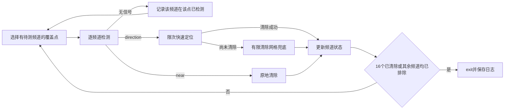

# 2026 国赛 B 题：最终可执行建模与求解方案

> 版本：2026-09-11 最终思路版。依据题目 PDF、附件1、附件2，在 GS07、GS12 整合稿及其审查基础上重写。
> 交付目标是可直接据此编程的模型、算法和验证方案，不声称获得全局最短时间。本文的本地验证结果不属于官方演练或正式测试成绩。

## 1. 总体结论与设计选择

采用一套具有明确分工的闭环：**保证覆盖发现频道 → 限次快速逼近与清除 → 必要时有限覆盖清除 → 恢复剩余频道扫描**。

- 问题一用半平面交构造定位多边形，用顶点枚举与旋转卡壳求直径，用直径端点圆的顶点判据回答覆盖性。
- 问题二在保证接收信号的候选域中，按模拟第二次观测后的区域直径和移动时间选点。数值设计结果只称为离散候选，不冒充连续全局最优。
- 问题三用一个中心点和六个半径 1200 m 的环点保证发现全部全向源。发现一个频道后立即处理，不要求先扫完所有点。
- 问题四用延伸到目标圆外的 900 m 正三角形格网保证发现所有朝向的定向源，同一覆盖也适用于全向源。定位清除不依赖事先判别源类型。
- 快速定位只是提速层；每个已发现源都有至多 225 个清除中心的有限兜底。即使侧移无信号、几何退化或启发式判断欠佳，也不会无限补测。

不再使用固定 382 m 逼近阈值、一般最优交会角 54.74°、未经证明的最少覆盖点数、单侧无信号判空闲或 BHH 时间下界。本文不引入尚无先验支撑的概率模型、方向极大似然或完整 POMDP 求解器。



## 2. 题设、参数与动作语义

### 2.1 固定参数

| 项目 | 取值与含义 |
|---|---|
| 目标区域 | \(\mathcal D=\{G:\|G\|\le1800\}\)，允许机器狗走到区域外 |
| 源数与频道 | 总数 10–16；频道 1–20，每频道至多一个源 |
| 初态 | 位置 \((0,0)\)，测向机频道 1 |
| 接收半径 | 每源固定 \(r_c\in[1000,1500]\) m，未知 |
| 定向覆盖 | 真实发射朝向左右各 90°，含边界 |
| 测向误差 | 题设 ±1°；同一点误差固定，不假设邻近点独立 |
| 算法角度界 | 一律使用保守 \(\delta=1.005^\circ\)，包容两位小数舍入；内部转弧度 |
| 运动 | 直线、5 m/s；运动中不检测 |
| 检测、切换 | 一次检测5 s；只有检测频道变化时加1 s |
| 清除 | 距离≤20 m一定成功；成功5 s，失败3 s；不切换测向机频道 |
| `near` | 位于辐射范围且距离≤5 m；无方位角，立即原地清除 |
| 坐标约束 | 每分量为有限数，绝对值≤2,000,000 m |
| 时间限制 | 测试窗口25 min；enter后至多20 min现实时间；虚拟时间100 h |

采用 1.005° 是安全外包络，不表示题设误差被重新定义。即便最终读数本来已满足 ±1°，这一选择也只略微保守。

### 2.2 统一记号

\(S\) 为测点，\(G\) 为源位置，\(\widehat\theta\) 为测得示向度。

\[
u(\theta)=(\cos\theta,\sin\theta),\qquad
n(\theta)=(-\sin\theta,\cos\theta).
\]

角度都由 `atan2` 生成并归一化；角度差用 `atan2(sin(a-b),cos(a-b))`，避免跨越 0° 时判断错误。\(\psi\) 专指**源向外发射方向**，与测点指向源的示向度不是同一个量。

### 2.3 逐动作计时：唯一口径

按实际动作执行顺序维护 `position` 和 `current_measure_channel`。对第 \(k\) 个 `/measure` 或 `/clear`，令前一个已接受动作的位置为 \(p_{k-1}\)，请求位置为 \(p_k\)：

\[
\Delta T_k=\frac{\|p_k-p_{k-1}\|}{5}+
\begin{cases}
5+\mathbf1[c_k\ne c_{\rm current}],&/measure,\\
5,&/clear\text{ 成功},\\
3,&/clear\text{ 未发现}.
\end{cases}
\]

仅 `/measure` 成功被接受后更新测向机频道；两类动作成功被接受后都更新位置。`accepted=false` 不更新任何物理状态，其 `virtual_time_s=0` 不可覆盖上一有效时刻。`/enter`、`/exit` 本身不增加虚拟时间。重试幂等动作不得重复累计。

校验例：原点测频道1，移动到(300,400)清除频道3成功，再回原点测频道1，总时间为 \(5+100+5+100+5=215\) s，切换次数为0。

## 3. 问题一：定位区域、直径与圆覆盖

### 3.1 纯测向区域

每次返回 `direction` 的角度约束为：

\[
W_i=\{X:(X-S_i)\cdot n(\widehat\theta_i-\delta)\ge0,
\ (X-S_i)\cdot n(\widehat\theta_i+\delta)\le0\}.
\]

法向量与边界射线垂直。中心射线 \(X=S_i+t u(\widehat\theta_i),t\ge0\) 在两式中的点积分别为 \(t\sin\delta\) 和 \(-t\sin\delta\)，因此确实被保留。

问题一的核心输出为纯楔形交集 \(P_w=\bigcap_iW_i\)。不要无提示地用目标圆盘截断它，然后把新区域直径当成原定位多边形直径。

### 3.2 明确的求交算法

将所有约束写成 \(a_j\cdot X\le b_j\)，其中非零 \(a_j\) 归一化为单位向量。

1. **找可行点。** 枚举原点、原点向各边界直线的垂足、所有非平行边界线交点，保留满足全部约束的点。若没有可行候选，返回 `EMPTY`。理由：非空闭凸多面体上离原点最近的点，位于内部、单条边界或至少两条边界交点，三类枚举覆盖全部情况。
2. **判断无界。** 枚举每条边界的两个单位切向方向 \(d\)。若存在 \(a_j\cdot d\le0\) 对所有约束成立，则衰退锥含非零方向，返回 `UNBOUNDED`；没有约束时也直接无界。二维非平凡多面锥必有这种边界方向。
3. **生成顶点。** 对有界非空集，收集满足全部约束的边界交点，去重并作凸包，按逆时针排序。一个点、线段作为退化集单独返回。
4. **输出。** `region_type, vertices, diameter, diameter_endpoints, diameter_circle_covers`。空集的直径返回 `null`，无界返回 `infinity`，不伪造有限多边形。

约束数为 \(m\) 时，上述易实现版本约 \(O(m^3)\)，本题测点少，足够使用。普通情况双精度计算；长度容差 \(10^{-7}\) m，方向判定容差 \(10^{-12}\)。行列式过小或边界分类受容差影响时，以50位十进制重算该判定；仍不能稳定分类则返回 `NUMERIC_UNCERTAIN`，不得把不确定当空集。这里的容差是工程判断，不是新的物理误差界。

已有有界多边形时，每加入一个半平面使用 Sutherland–Hodgman：内→内输出终点，内→外输出交点，外→内输出交点和终点，外→外不输出。对 \(f(X)=a\cdot X-b\)，交点为

\[
X=A+\frac{f(A)}{f(A)-f(B)}(B-A).
\]

### 3.3 直径和直径圆

有界凸多边形的直径为

\[
D_P=\max_{i,j}\|V_i-V_j\|.
\]

顶点枚举 \(O(h^2)\) 作为校核实现，旋转卡壳 \(O(h)\) 作为主实现。卡壳遇到等面积对踵位置时，两组候选都检查；点集和线段直接计算。

设直径端点为 \(A,C\)，圆心 \(M=(A+C)/2\)。直径圆覆盖多边形，当且仅当

\[
\max_i\|V_i-M\|\le D_P/2,
\quad\text{等价于}\quad
\max_i(V_i-A)\cdot(V_i-C)\le0.
\]

**回答：不一定覆盖。** 判据失败即为反例。平面集合的最小覆盖圆半径满足
\(D_P/2\le R_{\rm MEC}\le D_P/\sqrt3\)。直径与最小覆盖圆不是同一指标。

本地验证给出一个由三站误差楔形实际形成的四边形反例：\(D_P\approx47.358570\) m，直径圆半径23.679285 m，但最远顶点距圆心27.589055 m。完整观测坐标和顶点保存在验证结果 JSON，避免只用任意三角形替代可实现的测向构型。

### 3.4 在线算法采用保守多边形外包络

在线定位另记 \(P\)，它包含所有可能源位置，加入目标区域和有信号的距离约束。圆盘用**外切**64边形表示：

\[
B(c,r)\subseteq O_{64}(c,r)=
\bigcap_{j=0}^{63}\{X:u(2\pi j/64)\cdot(X-c)\le r\}.
\]

外包络最大径向超出为 \(r(\sec(\pi/64)-1)\)：1800 m圆约2.171 m，1500 m圆约1.809 m。该误差只说明单个圆的外扩量，不据此声称任意近平行交集的直径误差也同样小。

在线初值 \(P=O_{64}(0,1800)\)；收到 `direction` 后执行
\[
P\leftarrow P\cap W(S,\widehat\theta)\cap O_{64}(S,1500).
\]

用 \(P\) 的顶点直径和覆盖半径得到的都是实际位置集合的保守上界。只有 \(P\subseteq B(C,20)\) 才能保证在 \(C\) 清除；不能使用内接圆盘多边形把真实源裁掉。

## 4. 问题二：第二检测点策略和候选区域

### 4.1 完整的首次观测信息

首次已经返回示向度时，精确源状态可行集应为

\[
\Omega_1=\{(G,r):G\in\mathcal D\cap W_1,
1000\le r\le1500,\ 5<\|G-S_1\|\le r\}.
\]

首次观测不是仅有角度约束。它还排除了接收距离之外和 `near` 范围内的状态。

保证第二点接收到信号的精确条件为
\[
C_{\rm exact}=\{S:\sup_{(G,r)\in\Omega_1}(\|S-G\|-r)\le0\}.
\]

为便于实现，采用更保守、易认证的充分条件：
\[
C_{\rm safe}=\{S:\max_{V\in\operatorname{vert}(P)}\|S-V\|\le1000\}.
\]

因为 \(P\) 包含实际源位置，且距离凸函数在多边形上的最大值可由顶点获得，上式保证接收；它不是“用两个端点近似完整区域”。得到 `near` 同样算有效接收，此时立即清除，不构造不存在的第二条方位线。

### 4.2 定位效果的评价

给定候选点 \(S\)，第二次角度可能为
\(\widehat\theta_2=\operatorname{atan2}(G-S)+e\)，其中 \((G,r)\in\Omega_1\)、\(|e|\le\delta\)。正常方位分支的后验外包络为
\[
P_2=P\cap W(S,\widehat\theta_2).
\]

连续稳健目标可定义为全部可行源状态和误差下的最大后验直径；`near` 分支的位置集合直径至多10 m，且可立即清除。在线不声称求得这个连续极大极小问题的精确解。

实际选点使用可复现的离散评分：
\[
F(S)=\widehat J(S)+0.05\,\frac{\|S-S_1\|}{5}.
\]

\(\widehat J\) 为下面规定的有限样本最大直径，单位m；0.05的单位为m/s，使评分量纲一致。它是固定设计权重，不代表物理定律。

### 4.3 冻结的数值设计步骤

在 \(u=u(\widehat\theta_1)\)、\(w=n(\widehat\theta_1)\) 坐标系下：

1. 构造前述在线外包络 \(P=O_{64}(0,1800)\cap W_1\cap O_{64}(S_1,1500)\)。保留顶点，源样本允许略微超出精确状态集，以简化计算并保守探索。
2. 候选点为 \(S=S_1+a u+b w\)，\(a=0,50,\ldots,1500\)，\(b=-1000,-950,\ldots,1000\) m。删除坐标非法点，并要求所有 \(P\) 顶点距候选点≤999 m，预留1 m距离余量。
3. 源样本取每条 \(P\) 边上按≤100 m间距分点，再加顶点算术平均点。对每个源样本枚举 \(e\in\{-\delta,0,\delta\}\)。距离≤5 m按 `near` 处理，否则裁剪第二楔形并求直径。取最大值为 \(\widehat J\)。**这些离散样本不构成连续最坏情况的证明。**
4. 按 \((F,\|S-S_1\|,a,b)\) 字典序选名义第二点。候选为空时，补入 \(S_1+750u\) 检查；仍无法认证则报告几何输入异常，不把“没有候选”当目标不存在。
5. 令合格中心集 \(A=\{S:F(S)\le1.2F_{\min}\}\)。对每个中心取
   \[
   \epsilon_S=\min\{10,(1000-\max_V\|S-V\|)/2\}\text{ m}.
   \]
   输出候选区域 \(\mathcal C=\bigcup_{S\in A}B(S,\epsilon_S)\)。由三角不等式，该区域内每点都满足接收充分条件；1.2倍评分只针对圆心，不宣称圆内所有点都满足同一精度阈值。
6. 输出名义点、候选圆列表、评分热力图数据、距离约束余量和采样配置。圆面积重叠不简单相加；无需总面积才能执行选点。

\(750u\) 是正常输入的安全备用：实际首测可行位置沿视线距离≤1500 m、横向偏离很小，因此距该中点约≤751 m；对外包络也直接以顶点认证，不只依赖近似估计。

本地算例：\(S_1=(0,0),\widehat\theta_1=0\)，上述50 m网格产生169个安全中心；选中 \((850,-500)\) m，有限样本最大直径约114.988437 m，最远外包络顶点距离986.154146 m。反射点可能因浮点并列次序不同被选中。这是本算法的可复算设计例，不是官方案例、连续最优坐标或精度保证。

### 4.4 AOA 几何指标的适用范围

若需要解释第二测点为何应带侧向分量，正确雅可比为
\[
J_i=\frac1{\|G-S_i\|}(-\sin\theta_i,\cos\theta_i).
\]

近平行会放大误差，距离越远同一角误差对应的横向误差越大。局部协方差或 \(\operatorname{tr}((J^TJ)^{-1})\) 只能作为解释或辅助评价，不能替代接收约束。删除原稿的通用54.74°最优结论和相应382 m阈值，不让受限旧推导进入最终控制器。

问题二的网格计算用于离线设计与论文展示；问题三、四的每一步不重复执行这一大规模扫描，使用第6节固定的轻量策略，以保留现实运行时间预算。

## 5. 覆盖、频道状态和混合源处理

### 5.1 全向源：七点覆盖

\[
Q_O=\{(0,0)\}\cup\{1200(\cos(k\pi/3),\sin(k\pi/3)):k=0,\ldots,5\}.
\]

对目标点使用离它最近的环方向，其夹角 \(|\phi|\le\pi/6\)。目标点到中心和该环点的距离分别为
\(r\) 与 \(\sqrt{r^2+d^2-2rd\cos\phi}\)，其中 \(d=1200\)。两者较小值在径向区间上的最大值，只需检查切换点 \(r=d/(2\cos\phi)\) 和边界 \(r=1800\)。由此获得全域覆盖半径
\[
\rho=\max\{d/\sqrt3,
\sqrt{1800^2+d^2-\sqrt3\cdot1800d}\}
\approx968.901572<1000\text{ m}.
\]

因此七点足够，且有约31.10 m余量。本文不讨论七点是否最少，以免把最少点数证明与可执行覆盖混在一起。

### 5.2 混合源：37点正三角形格网

取 \(h=900\) m，
\[
q_{k,l}=(h(k+(l\bmod2)/2),\sqrt3hl/2).
\]

枚举整数 \(k,l=-4,\ldots,4\)，保留 \(\|q_{k,l}\|\le2700+10^{-7}\) 的点，得到37点。按 `(距原点距离,x,y)` 排序得到固定编号。这里 `l mod 2` 必须取0或1，负整数行也如此。

**充分性证明：** 无限格网将平面剖分成边长900 m的闭等边三角形。任意 \(G\in\mathcal D\) 属于至少一个三角形，距其三个顶点均≤900 m。三个顶点距原点≤1800+900，因此全部被保留。设局部观测点集 \(Q_G=Q\cap\overline B(G,1000)\)，则
\[
G\in\operatorname{conv}(Q_G).
\]

对任意发射朝向，若所有 \(q-G\) 在前向方向投影均为负，它们的任意凸组合也为负，与 \(G\) 位于凸包内矛盾。因此至少一个点落在含边界的前向半平面且距源≤1000 m，必能接收。

源位于三角形边或顶点时仍成立；**不强制它在单个基本三角形中具有正凸包深度**。正距离余量由900<1000提供；题设的辐射角边界本来就包含在有效范围内。圆周上朝外的源由圆外格点覆盖。37点是本构造的点数，不是定向问题最少点数。

### 5.3 每频道状态

| 状态 | 准确定义 | 转移 |
|---|---|---|
| UNKNOWN | 尚无 `direction`/`near`，但可能有无信号记录 | 正反馈→ACTIVE；全部覆盖点无信号→EXCLUDED |
| ACTIVE | 已确认存在且尚未清除 | 局部控制器成功→CLEARED；矛盾→ERROR |
| CLEARED | 收到该频道清除 `success` | 永不再测或清除该频道 |
| EXCLUDED | 该频道在适用覆盖点集全部返回无信号 | 不再搜索 |
| ERROR | 几何或协议与保证条件冲突 | 保存现场、停止正常推断，不伪报全清 |

数据结构固定为：`status, no_signal_site_ids, first_bearing, bearing_history, P, failed_clear_centers`。另外维护已接受动作日志、当前物理位置、测向机频道、已清除计数和现实截止时刻。

覆盖证据按**频道**累计。不能用“狗走过了全部网点”替代“该频道在全部网点都被检测”。ACTIVE 即使后续测不到，也不能转成空闲。

### 5.4 混合类型的正确处理

物理模型明确包含类型 \(\tau\in\{O,D\}\)：
\[
\operatorname{receive}(S;G,r,\tau,\psi)
\Longleftrightarrow \|S-G\|\le r\ \land
[\tau=O\ \lor\ (S-G)\cdot u(\psi)\ge0].
\]

如果要做精确联合推断，必须维护两种类型状态的**并集**，不能把所有观测都塞进定向半平面模型。本版本为节省计算，不主动估计类型与朝向：

- 对两类源都安全地使用 `direction` 的楔形与1500 m上界。
- `near` 直接清除。
- 对ACTIVE的 `no_signal` 只记历史，不对 \(P\) 施加未经证明的“背向”或距离剪枝。
- UNKNOWN只通过整套覆盖证书判空闲。

这会放弃部分负观测带来的提速，但没有类型误判的风险，也不需要求解四维非凸可行集。特别是全向源在环绕它的三个测点都有信号时，不会因不存在共同半平面而被错误排除。

对问题三，全向 `no_signal` 的精确信息是 \(\|S-G\|>r\ge1000\)。可以写入历史约束，但主实现不强行将“多边形减圆盘”压成一个凸多边形；有限兜底不依赖这项优化。

## 6. 发现后的定位与清除控制器

### 6.1 快速层：最多六次常规动作

收到首条方位后，记 \((S_f,\theta_f)\)，构造 \(P\)。设置 `probe_count=0, trial_count=0, action_count=0`。

每轮计算顶点算术平均 \(C\) 和 \(R_C=\max_V\|V-C\|\)。这里不把顶点平均误称为面积质心或最小覆盖圆圆心。

1. 若 `trial_count<2` 且 \(R_C\le40\) m，到 \(C\) 尝试清除，计一次动作。\(R_C\le19.5\) 时是有0.5 m余量的保证性清除；19.5–40 m时是明确允许失败的低成本试探。
2. 否则，若 `probe_count<4`，生成 \(C\) 以及以 \(C\) 为中心、半径60、150、300 m、间隔45°的24点。删除距任一已测点<1 m或距原点>3000 m的点。
3. 候选测点按
   \[
   H(S)=\frac{\|S-p_{\rm current}\|}{5}
   +\frac{0.035\|S-C\|}{5}
   \]
   排序，取最小者；并列按 `(x,y)`。这是“优先便宜逼近”的固定代理指标：0.035约为两倍1°的小角尺度，不是预期总时间或定位误差的严格公式。选择不要求混合源在该点必然有信号，失败次数已被限制。
4. 检测返回 `direction` 则裁剪 \(P\)；`no_signal` 保持 \(P\)，消耗一次补测；`near` 立即原地清除成功后结束。near后的清除即使成为第七次动作也允许执行。
5. 清除成功立即结束；普通试探失败把该中心加入 `failed_clear_centers`。对已确认源，失败排除了该中心20 m闭圆盘内的位置；保持 \(P\) 作为凸外包络，另存失败圆盘，不扩大源集。若是半径≤19.5 m的保证性清除却失败，转ERROR核对接口，不当作普通试探继续。
6. 常规动作到六次、候选为空或补测与试探配额均耗尽时，进入兜底。新观测使 \(P\) 数值不可信时回退到首测外包络进入兜底，不据此判空闲。

四次补测不保证一定获得高质量交会，作用是让多数案例少做清除试探。真正的有限完成保证来自下一节。

### 6.2 有限清除覆盖：最多225个中心

以首测点 \(S_f\) 为原点，沿 \(u(\theta_f)\) 为纵轴 \(x\)，沿 \(n(\theta_f)\) 为横轴 \(y\)。首条方位给出实际源满足
\[
0\le x\le1500,\qquad |y|\le1500\sin(1.005^\circ)
\approx26.309490<30\text{ m}.
\]

所以只需覆盖矩形 \([0,1500]\times[-30,30]\)。把它分成75列、3行的20 m闭正方形，中心为
\[
C_{ij}=S_f+(20i+10)u(\theta_f)+(-20+20j)n(\theta_f),
\quad i=0,\ldots,74,\ j=0,1,2.
\]

任何格子内的点距格心≤\(10\sqrt2\approx14.142136<20\) m。因此，不需要继续获取无线电信号，也不需要知道类型或朝向，覆盖实际源所在格子的清除必然成功。

**执行细节：**

1. 进入兜底时冻结可信 \(P\)。按列递增遍历；偶数列行序0→1→2，奇数列2→1→0，形成蛇形顺序。
2. 用四次半平面裁剪检查闭格子与 \(P\) 是否相交；可靠为空的格子跳过，边界/数值不确定的格子保留。
3. 若一个格子的四个顶点都在某个已失败清除中心的 \(20-10^{-7}\) m圆盘内，可跳过整个格子。其余格子逐一到中心 `/clear`。
4. 成功立即结束。为了简洁、可验证，不对剩余格子重做旅行商优化；跳过部分格子不会增加蛇形路径长度。
5. 若剪枝列表耗尽但仍未清除，用未经剪枝的完整225中心列表补查尚未尝试中心，最多再补齐到225个不同中心。仍失败则进入ERROR：这与首测距离、误差或清除语义矛盾，保存现场后退出，不无限循环。

数学保证是在观测和清除接口遵循题设、通信可继续的前提下成立。浮点不确定分支采用保留/补查，不能悄悄跳过可能包含源的格子。

### 6.3 为什么该兜底不等于全域盲扫

在半径1800 m圆域用清除圆盲扫成本很高。这里先用无线电发现一个**确定存在的频道**，把搜索区域缩成最多1500×60 m的窄条，再按新增方位进一步删格。清除尝试始终只针对该频道。每源最多225中心是保守上限，通常只访问其中很小一部分。

## 7. 全局调度、终止与预算

### 7.1 确定的调度流程

```text
初始化覆盖点Q，20个UNKNOWN，位置(0,0)，频道1
while 清除数<16:
    U = 所有UNKNOWN频道
    若U为空：正常结束
    对每个UNKNOWN频道：若Q中全部点均有no_signal，置EXCLUDED
    找仍有UNKNOWN频道未测的覆盖点，取距当前位置最近者；并列取编号小者
    若无这样的覆盖点：正常结束
    在该点待测频道中，当前测向机频道优先，其余按频道编号递增
    for c in 待测频道:
        measure(Q点,c)
        no_signal: 记入c的已测无信号点集，继续本点频道
        near: 原地clear；成功后置CLEARED；跳出频道循环重选覆盖点
        direction: 置ACTIVE；运行局部控制器直至清除或ERROR
                   成功则置CLEARED；跳出频道循环重选覆盖点
        ERROR/时限保护: 转异常退出，不标记正常完成
正常结束前验证：清除数=16，或20频道全为CLEARED/EXCLUDED
exit；保存本地日志和成绩摘要
```

每次局部处理结束后重新选择最近尚有待测频道的覆盖点，可以顺路推进粗搜；不强制返回刚离开的点。已清除频道不再扫描。局部过程每次只处理一个已确认频道，成功后才恢复全局过程，避免复杂任务抢占状态。

### 7.2 清除保证的逻辑链

1. 覆盖构造保证每个实际源在至少一个所属频道检测点出现 `direction` 或 `near`。
2. 全局待测集合只会减少；未确认频道不会因部分无信号提前排除。
3. 每个正反馈频道由限次快速层或有限清除矩形处理；近距离直接清除。
4. 每个频道至多一个源，成功不会重复计数；最多16个源。
5. 因而在题设模型与足够现实执行时间下，正常退出时所有实际源均被清除。超时/通信失败退出与正常完成严格区分。

### 7.3 有限动作与虚拟时间上界

混合场景覆盖点37个，全部频道粗测最多740次。每源快速层最多7个动作、兜底最多225次清除，总动作数不超过
\[
740+16(7+225)+2=4454,
\]
其中2为enter和exit。通常会因清除后跳过频道和剪枝远小于此数。

正常无数值补查的蛇形整表相邻中心距离20 m，225中心内部路程4480 m。局部快速动作点限制在原点3000 m内，首测覆盖点在2700 m内，到蛇形首中心的接入距离≤5723 m，因此一次完整兜底移动≤10203 m、清除动作≤677 s。

局部完成位置距实际源≤20 m，故返回全局调度时距原点≤1820 m。覆盖点间最大距离≤5400 m；全局访问段最多37+16=53段。用每个快速动作最多6000 m移动作很松的统一上界：
\[
T<53\frac{5400}{5}+740\cdot6
+16\left[7\left(\frac{6000}{5}+6\right)+\frac{10203}{5}+677\right]
<250000\text{ s}<70\text{ h}<100\text{ h}.
\]

这一上界针对正常模型计算路径，目的仅为排除虚拟时限风险，不是效率评价。数值补查若重新访问早先省略格子，路径不再适用同一蛇形上界；该异常分支另按接口返回的剩余虚拟预算控制，不沿用上述证明。

现实20 min仍必须单独控制：请求传输、模拟器处理和本地计算不能用虚拟时间代替。4454动作若平均每动作约0.27 s便已接近1200 s，故在正式演练中必须测量延迟；不作现实时间无条件成功承诺。

### 7.4 冻结的实现参数

| 参数 | 最终默认值 |
|---|---|
| 角度外包络 | 1.005° |
| 圆盘外切边数 | 64 |
| 全向覆盖 | 中心+1200 m六环点 |
| 混合覆盖 | h=900 m，保留2700 m内格点，37点 |
| 快速局部测点 | 平均点及60/150/300 m三环、每环8点 |
| 局部配额 | 补测≤4，普通试探≤2，常规动作≤6；near清除允许追加 |
| 清除阈值 | 半径≤19.5 m为保证性尝试；≤40 m允许试探 |
| 兜底 | 20 m方格，75×3，蛇形，清除半径20 m |
| 数值保留 | 长度1e-7 m；不确定格子不删除 |
| 问题二离线网格 | 测点50 m；源边界100 m；误差三个端点/中点样本 |
| 问题二设计权重 | 0.05 m/s；候选中心评分≤最小值1.2倍 |
| 可视化/日志 | 只在本地计算，不在每次动作中渲染图表 |

## 8. 官方接口与异常处理规范

### 8.1 请求、响应和状态提交

默认地址 `http://127.0.0.1:2026`，端口可从模拟器设置读取。只使用 POST `/enter`、`/measure`、`/clear`、`/exit`；路径不加尾斜线、查询参数。`Content-Type: application/json; charset=utf-8`，UTF-8无BOM JSON对象，无重复键。

```json
{"arena_id":"default","robot_id":"实际参赛队号","request_id":"本次会话UUID-递增序号"}
```

`/measure`、`/clear` 再增加：

```json
{"position":{"x":300.0,"y":400.0},"channel":1}
```

以上第二段是字段增量，实际发送时与公共字段合成同一个对象。不得添加调试字段。`robot_id`为模拟器当前登录队号，不在文档中写凭据。

客户端每次只允许一个未决动作：保存完整请求→发送→检查HTTP与JSON→仅在`accepted=true`时一次性提交位置/频道/观测/时间。`direction`时读取`svd_deg`；`near`、`no_signal`时不读取。清除结果只有`success`、`no_target_in_range`。

### 8.2 幂等、重试与错误分支

- 每个新动作使用新的`request_id`。超时或连接中断导致执行状态不明时，只能重发完全相同的请求和ID；不能先生成下一动作。
- 每次连接/读响应超时上限5 s，并裁剪为不超过当前现实剩余预算；不明状态最多重试3次，间隔0.2、0.5、1 s。到达截止时刻前保留至少5 s停止发新动作。
- HTTP 200且`accepted=false`：动作未生效，保留旧状态；保存响应并停止正常执行，提示检查队号、字段和测试状态，不盲重试。
- HTTP 400/404/405/409/413/415：视为请求或并发配置错误，保存原请求，停止正常执行。429等待1 s后按同ID重试且计入上述配额；500按不明状态同ID重试。
- 非JSON、连接关闭、重试耗尽：保存未决动作和历史，标为通信异常；未决动作未确认前不发送不同动作或exit。测试可能已结束，不能靠事后exit查询原因。
- `near`后原地清除失败、保证清除失败、兜底全表耗尽：保存现场，标为模型/接口异常。保证清除失败可先核对动作位置与频道，不静默转为空闲。
- 尚无未决动作且接口仍有效时，异常终止可发送一次带幂等ID的exit；不得把主动中止的结果记为正常全清。

这些处理只说明客户端应如何实现；本轮验证脚本未联调真实HTTP服务。

### 8.3 时间与结果保存

在调用enter前记录本地单调时间 `t_send`；响应后用
`deadline=t_send+remaining_real_duration_s` 保守设置截止时刻，预留5 s收尾。每次响应同时检查服务器虚拟时间与本地分项累计，允许浮点/微秒取整累计误差，差异超过 `max(0.001,动作数×1e-6)` s时保存报警证据。

开始后30次响应统计请求延迟，打印剩余动作粗上界×延迟的预算提示。预算不足时关闭问题二离线设计和图表输出，保留轻量控制器；不得删掉覆盖检测来伪造“全清保证”。预留时间到达则退出并报告未完成状态。

日志按JSONL保存：请求ID、路径、位置、目标频道、发出/收到单调时间、HTTP状态、原始业务响应、提交后位置与测向机频道、分项虚拟时间、状态变化、失败原因。原始通信日志与论文摘要分开；官方加密日志由模拟器导出，原名保留，不修改内容。

## 9. 验证证据与正式测试安排

### 9.1 已完成的本地验证

同目录文件：`最终方案验证.py`、`最终方案验证结果.json`。脚本只使用Python标准库，不访问模拟器，不读取隐藏案例数据，不消耗正式测试机会。执行命令：

```powershell
python "E:\QQ Files\数模\B题\最终方案验证.py"
```

没有系统Python时，可用当前Codex依赖Python的完整路径替换命令中的`python`。

| 检查 | 本次结果 | 证据边界 |
|---|---|---|
| 300组随机三站多边形，枚举/卡壳直径互校 | 最大绝对差0 m（本次浮点实现） | 不能替代所有退化构型证明 |
| 实际测向多边形的直径圆不覆盖反例 | 已生成坐标、顶点、直径和距离 | 由JSON保存全精度值 |
| 问题二固定50 m网格设计例 | 169安全候选，选点(850,-500) | 有限采样，不是连续最坏误差证明 |
| 跨零、误差端点与清除网格覆盖 | 30例通过 | 测角±1°后两位小数输出 |
| 格网位置—朝向组合检测 | 51,840组合通过 | 零漏测保证依赖第5节证明，而非采样次数 |
| measure→clear→measure计时 | 215 s；清除不切换频道 | 本地语义验证，非HTTP联调 |
| 随机全向/混合源闭环 | 24局，N取10、13、16 | 固定位置相关有界误差场 |
| 圆周朝外15源+原点1源 | 普通策略、强制兜底各1局通过 | 专门覆盖边界朝向与near分支 |
| 合计26局 | 均全清；最大虚拟时间15344.949 s，最大动作612 | 两个最大值分别统计；不是官方成绩 |
| 额外12组配对消融（每组两次运行） | 快速层平均9886.395 s，直接兜底平均12114.852 s，平均下降18.39%；10组更快 | 同一源配置、同一误差场；两种策略均全清，不能推及所有环境 |

配对消融说明快速层在该批样本中具有时间收益，也明确有2组未获益，因此保留“启发式提速”的表述。该比较不是对所有可能算法的最优性证明。

脚本验证的是核心几何和控制闭环，没有实现官方GUI操作、网络故障注入、全部任意精度退化处理或论文绘图。因此，它是可复算依据与核心参考实现，不冒称完整官方参赛客户端。

### 9.2 演练实施顺序

1. 按第8节实现串行客户端，用本地固定动作序列核对计时、频道和幂等状态提交；特别测试执行已成功但响应丢失的同ID重试。
2. 模拟器联网登录并完成时间校验；分别进入问题三、四**演练**，等待接口就绪再enter。
3. 先检查全清比例与终止证据，再比较平均定位清除时间、快层清除占比、兜底格子数和请求延迟；全清和预算合格后才考虑改变默认参数。
4. 本版默认参数冻结。若根据演练修改参数，必须在单独配置文件保存新版本与整套回归结果，不在正式测试中临时换策略。
5. 用户启动正式测试后，每题完成三次，保留案例编码、程序运行时间、清除数、平均时间和模拟器导出的原名日志。中止仍消耗正式机会。

北京2026-09-13 17:30后不能启动新测试，题目建议15:30前完成正式测试。已启动测试及已入队日志上传按题目规定继续。这里只记录题目与附件给定安排，不额外推断服务时间。

### 9.3 指标与题目规定的结果表

演练结束可从模拟器获得实际总数：
\[
\text{清除比例}=N_{\rm clear}/N_{\rm total},\qquad
\text{平均定位清除时间}=T_{\rm virtual}/N_{\rm clear}.
\]

零清除时平均值记`N/A`，不除以零。正式测试不显示真实总数，不以自己猜测的N计算实测清除比例；“根据覆盖与退出条件判定全清”与“模拟器披露真值后统计全清”分别标注。现实程序运行时间独立记录。

**问题三正式测试表：**

| 测试案例编码 | 清除干扰源个数 | 平均定位清除时间/s | 程序运行时间/s |
|---|---:|---:|---:|
| 待测试1 | — | — | — |
| 待测试2 | — | — | — |
| 待测试3 | — | — | — |

**问题四正式测试表：**

| 测试案例编码 | 清除干扰源个数 | 平均定位清除时间/s | 程序运行时间/s |
|---|---:|---:|---:|
| 待测试1 | — | — | — |
| 待测试2 | — | — | — |
| 待测试3 | — | — | — |

以上“待测试”不是案例编码。实际测试后原位替换，并在支撑材料索引中逐一关联官方原名日志。

## 10. 六维度收敛检查

| 维度 | 最终处理与证据 | 仍然明确保留的限制 |
|---|---|---|
| 准确性 | 修正动作时间、法向量、首次距离、near、类型并集与凸包边界；提供证明和反例 | 浮点异常与官方接口仍需端到端联调 |
| 完整性 | 四问、候选区域、覆盖、控制器、有限兜底、时限与正式结果表全部贯通 | 不填尚未进行的官方测试成绩 |
| 清晰性 | 纯问题一多边形与在线外包络分开；保证、代理评分和实测结果分开 | 公式较多，读者需基础计算几何知识 |
| 可执行性 | 参数、排序、动作配额、反馈与重试分支冻结；附核心参考脚本 | 官方客户端和图表按本文接口实现，不伪装为已交付程序 |
| 简洁性 | 删除重复审查历史、失效解析分支和非必需概率优化 | 为保留可实现性，证明和异常处理未进一步压缩 |
| 总体 | 一套闭环，不再将互相冲突的路线作为等价主方案 | 不声称时间全局最优或现实期限内无条件成功 |

自检评分（满分5分，仅评价本思路交付）：准确性4.4、完整性4.5、清晰性4.4、可执行性4.3、简洁性4.3，等权总体4.4。证据与限制见上表；它们不是竞赛评审得分。后续最重要的验证是官方演练的请求延迟、清除表现及断线幂等处理，不再靠增加未经验证的理论模块提高纸面评分。

## 11. 来源与文件关系

1. `B题.pdf`：题目、物理参数、四问、正式测试与截止要求。
2. `附件/附件1.docx`、`附件/附件2.docx`：动作计时、频道状态、HTTP协议、近距/清除语义、幂等与测试窗口。
3. `GS07：2026国赛B思路.pdf`：方位向量、交会定位、粗搜与路径成本的初始思路。
4. `GS12：2026数学建模国赛B题建模思路与求解方案.pdf`：半平面、直径算法、候选布站及覆盖讨论的初始思路。
5. `思路审查_GS07_GS12.md`、`2026国赛B题思路整合_GS07_GS12_修订版.md`：本版问题定位的历史依据；不将其未验证数值当最终结论。
6. `最终方案验证.py`、`最终方案验证结果.json`：本版新增的可复算本地证据。完整格网与有限清除兜底的保证依赖本文推导，不依赖某个随机种子。

本文件作为后续实现与论文展开的主版本；历史整合稿和修订稿保留供追溯，不再与本文件并列作为执行规范。
